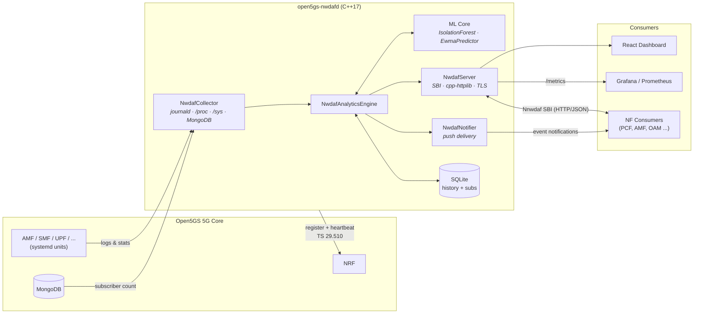

<div align="center">

# 🛰️ Open5GS NWDAF

### Production-grade Network Data Analytics Function for 5G Core — in modern C++

**Standalone, 3GPP Release-17 compliant NWDAF that plugs into [Open5GS](https://open5gs.org) and brings native ML-driven analytics to your 5G core.**

[](https://github.com/cem8kaya/open5gs-nwdaf/actions/workflows/ci.yml)
[](LICENSE)
[](https://isocpp.org/)
[](https://www.3gpp.org/specifications-technologies/releases/release-17)
[](https://portal.3gpp.org/desktopmodules/Specifications/SpecificationDetails.aspx?specificationId=3579)
[](https://portal.3gpp.org/desktopmodules/Specifications/SpecificationDetails.aspx?specificationId=3355)
[](Dockerfile)
[](#-contributing)

[Quick Start](#-quick-start) · [Architecture](#-architecture) · [3GPP Compliance](#-3gpp-compliance) · [REST API](#-rest-api-ts-29520-sbi) · [Dashboard](#-dashboard--observability) · [Roadmap](#-roadmap) · [Contributing](#-contributing)

</div>

<!-- Add a dashboard screenshot at docs/assets/dashboard-overview.png and uncomment:

-->

---

## 💡 Why this project?

The **NWDAF (Network Data Analytics Function)** is the intelligence layer of the 5G Core defined by 3GPP — yet no complete, freely available open-source implementation exists that works out of the box with Open5GS. This project fills that gap:

- **Zero-friction Open5GS integration** — registers with the NRF, reads journald/`/proc`/`/sys`/MongoDB, no core patches required
- **Native, dependency-light ML** — Isolation Forest anomaly detection and EWMA prediction implemented in pure C++, no Python runtime, no TensorFlow
- **Spec-first design** — analytics IDs, SBI resource paths, subscription model and NRF registration follow TS 23.288 / TS 29.520 / TS 29.510
- **Ops-ready from day one** — Prometheus metrics, Grafana dashboard, React web UI, systemd unit, hardened Docker build, TLS/mTLS, OAuth2, rate limiting

## ✨ Features

| Capability | Details |
|---|---|
| 📊 **7 Analytics IDs** | NF load, UE mobility, UE communication, abnormal behaviour, QoS sustainability, service experience, network performance |
| 🤖 **Embedded ML** | Native C++ Isolation Forest (anomaly detection) + EWMA predictor (load forecasting), atomic model persistence, on-demand retraining via API |
| 🔔 **Subscriptions** | `Nnwdaf_EventsSubscription` create/list/get/delete with push notification delivery (background notifier thread) |
| 🗄️ **Persistence** | SQLite-backed throughput history and subscription store — survives restarts |
| 🛰️ **NRF Integration** | Registration + heartbeat per TS 29.510 §5.3.2.4 |
| 🔐 **Security** | TLS/mTLS on SBI (TS 33.501 §13.3), OAuth 2.0 bearer-token validation, per-IP + global token-bucket rate limiting, hardened build flags (`-D_FORTIFY_SOURCE=2`, PIE, RELRO) |
| 📈 **Observability** | Prometheus `/metrics`, Grafana dashboard JSON, health/readiness probes |
| 🖥️ **Web Dashboard** | React + Recharts "NWDAF Intelligence" UI: live throughput, anomaly detection, MOS scores, traffic simulator, subscription management |
| 🧪 **Tested** | 85 Catch2 test cases: unit, integration, and a mock Open5GS environment |
| 📦 **Deployable** | Reproducible two-stage Docker build (Ubuntu 22.04, pinned deps), systemd service, `cmake --install` |

## 🏗 Architecture



**Data collection strategy** (Open5GS-specific, all configurable):

1. **NF health** — systemd unit states via the `nf_service_names` map (no fragile string-stripping)
2. **Throughput** — reads `/sys/class/net/<iface>/statistics/` directly, because the `gtp5g` kernel module bypasses user-space capture (tcpdump/eBPF)
3. **UE activity** — AMF/SMF journald parsing with a configurable `supi_regex` (`imsi-(\d{15})` for Open5GS ≥ v2.7.6)
4. **Subscriber count** — optional MongoDB (UDR/UDM database) integration

## 📐 3GPP Compliance

| Analytics ID | TS 23.288 (Rel-17) | ML backing | Status |
|---|---|---|---|
| `NF_LOAD` | §6.5 | EWMA load prediction | ✅ Implemented |
| `UE_MOBILITY` | §6.7.2 | — | ✅ Implemented |
| `UE_COMMUNICATION` | §6.7.3 | — | ✅ Implemented |
| `ABNORMAL_BEHAVIOUR` | §6.7.5 | Isolation Forest | ✅ Implemented |
| `SERVICE_EXPERIENCE` | §6.4 | MOS estimation | ✅ Implemented |
| `NETWORK_PERFORMANCE` | §6.6 | Weighted composite score | ✅ Implemented |
| `QoS_SUSTAINABILITY` | §6.9 | Threshold trend analysis | ✅ Implemented |

**Referenced specifications:** TS 23.288 v17.3.0 (architecture) · TS 29.520 v17.7.0 (Nnwdaf services) · TS 29.510 v17.6.0 (NRF) · TS 28.554 v17.4.0 (KPIs) · TS 33.501 (security)

## 🚀 Quick Start

> **Verified on CI:** Ubuntu 22.04 (full: sd-journal + TLS + SQLite) and Ubuntu 20.04 (sd-journal + SQLite, TLS off) — see the [CI workflow](.github/workflows/ci.yml).

### Prerequisites

**Toolchain (required):**

```bash
sudo apt-get update
sudo apt-get install -y --no-install-recommends \
    build-essential cmake git pkg-config ca-certificates
```

- **CMake ≥ 3.22** is required. Ubuntu 22.04 satisfies this; **Ubuntu 20.04 ships CMake 3.16**, so install a newer one there (e.g. `pip3 install "cmake>=3.22,<4"` or the [Kitware APT repo](https://apt.kitware.com/)).
- An **internet connection is needed on the first configure**: cpp-httplib, nlohmann/json, yaml-cpp, spdlog (and Catch2 for tests) are fetched automatically via CMake `FetchContent`. You do **not** need to install these from apt.

**Optional feature dependencies** (each degrades gracefully if absent):

```bash
sudo apt-get install -y --no-install-recommends \
    libsystemd-dev \    # journald collection      (NWDAF_USE_SD_JOURNAL=ON)
    libssl-dev \        # TLS/mTLS on the SBI       (NWDAF_USE_TLS=ON, needs OpenSSL ≥ 3.0)
    libsqlite3-dev \    # restart-safe persistence  (history_backend=sqlite)
    libmongoc-dev libmongocxx-dev   # subscriber count via MongoDB
```

> **TLS needs OpenSSL ≥ 3.0** (Ubuntu 22.04+). On Ubuntu 20.04 (OpenSSL 1.1.1), build with `-DNWDAF_USE_TLS=OFF`.

### Build

**Ubuntu 22.04+ (full features):**

```bash
cmake -S . -B build -DCMAKE_BUILD_TYPE=Release
cmake --build build --parallel $(nproc)
```

**Ubuntu 20.04 (TLS off — OpenSSL 1.1.1):**

```bash
cmake -S . -B build -DCMAKE_BUILD_TYPE=Release -DNWDAF_USE_TLS=OFF
cmake --build build --parallel $(nproc)
```

**Minimal build** (no journald, no TLS — e.g. non-systemd hosts or containers):

```bash
cmake -S . -B build \
    -DNWDAF_USE_SD_JOURNAL=OFF \
    -DNWDAF_USE_TLS=OFF
cmake --build build --parallel $(nproc)
```

### Run

```bash
./build/open5gs-nwdafd --config config/nwdaf.yaml
curl http://127.0.0.1:7779/nwdaf-analytics/v1/health
```

### Run tests

```bash
cd build && ctest --output-on-failure
```

### Docker

The image is a multi-stage build on `ubuntu:22.04` (OpenSSL 3.0, so TLS-capable) and contains only the daemon binary and default config.

```bash
docker build -t open5gs-nwdaf .
docker run --rm -p 7779:7779 open5gs-nwdaf
```

> To reach the SBI from outside the container, set `sbi_bind_address: "0.0.0.0"` in your config — the default `127.0.0.1` only listens inside the container. Mount your own config with `-v $(pwd)/config/nwdaf.yaml:/etc/open5gs/nwdaf.yaml`.

### Install as a systemd service

```bash
sudo cmake --install build
sudo systemctl daemon-reload
sudo systemctl enable --now open5gs-nwdafd
```

## 🔌 REST API (TS 29.520 SBI)

Base URL: `http://<host>:7779`

| Method | Path | Description |
|--------|------|-------------|
| `GET` | `/nwdaf-analytics/v1/health` | Liveness probe (returns `UP` immediately) |
| `GET` | `/nwdaf-analytics/v1/ready` | Readiness probe (`READY` once ML models are fitted, `503` otherwise) |
| `GET` | `/nwdaf-analytics/v1/metrics` | Prometheus metrics |
| `GET` | `/nwdaf-analytics/v1/analytics?analyticsId=<ID>` | Fetch analytics (`Nnwdaf_AnalyticsInfo`) |
| `POST` | `/nnwdaf-analyticsinfo/v1/analytics` | Spec-compliant analytics request (POST body) |
| `POST` | `/nwdaf-analytics/v1/subscriptions` | Create subscription (`Nnwdaf_EventsSubscription`) |
| `GET` | `/nwdaf-analytics/v1/subscriptions` | List subscriptions |
| `GET` | `/nwdaf-analytics/v1/subscriptions/{subId}` | Get subscription |
| `DELETE` | `/nwdaf-analytics/v1/subscriptions/{subId}` | Delete subscription |
| `POST` | `/nwdaf-analytics/v1/train` | Retrain the Isolation Forest on collected history |

### Examples

```bash
# NF load analytics
curl "http://127.0.0.1:7779/nwdaf-analytics/v1/analytics?analyticsId=NF_LOAD"

# Anomaly detection
curl "http://127.0.0.1:7779/nwdaf-analytics/v1/analytics?analyticsId=ABNORMAL_BEHAVIOUR"

# Subscribe to events with push notifications
curl -X POST "http://127.0.0.1:7779/nwdaf-analytics/v1/subscriptions" \
  -H "Content-Type: application/json" \
  -d '{"eventId": "NF_LOAD", "notificationUri": "http://consumer:8080/notify"}'
```

## ⚙️ Configuration

Everything deployment-specific lives in [`config/nwdaf.yaml`](config/nwdaf.yaml):

| Parameter | Default | Description |
|---|---|---|
| `nf_instance_id` | — | **Mandatory.** Stable UUID of this NF instance |
| `plmn_mcc` / `plmn_mnc` | `999` / `70` | PLMN (test network default) |
| `sbi_bind_address` / `sbi_port` | `127.0.0.1` / `7779` | SBI endpoint (must not collide with Open5GS's 7777) |
| `nf_service_names` | `AMF→amfd`, … | Open5GS systemd unit suffix map |
| `throughput_interfaces` | `ogstun` | UPF tunnel interfaces to sample |
| `collection_interval_seconds` | `10` | Collector cadence |
| `supi_regex` | `imsi-(\d{15})` | SUPI extraction pattern (Open5GS v2.7.6) |
| `mongodb_uri` / `mongodb_db` | `127.0.0.1:27017` / `open5gs` | Optional subscriber-count source |
| `nrf_uri` | `http://127.0.0.10:7777` | NRF for registration + heartbeat |
| `nrf_heartbeat_interval_seconds` | `60` | TS 29.510 heartbeat (`0` = disabled) |
| `anomaly_contamination` | `0.10` | Expected anomaly fraction (Isolation Forest) |
| `anomaly_seed` | `0` | Deterministic ML seed (`0` = random) |
| `anomaly_min_samples` | `120` | Retrain quality gate (~20 min at 10 s interval) |
| `baseline_stddev_min_kbps` | `0.5` | Idle-baseline guard against zero-traffic false positives |
| `ewma_alpha` | `0.3` | EWMA smoothing factor |
| `history_backend` / `history_db_path` | `sqlite` | Restart-safe history + subscription persistence |
| `rate_limit_per_ip_rps` / `rate_limit_global_rps` | `10` / `100` | Token-bucket SBI rate limits (`0` = off) |
| `network_performance_weights` | `0.6/0.2/0.2` | NF-health / DL / PDU weights (validated to sum to 1.0) |
| `tls_enabled` + cert/key/CA paths | `false` | TLS; setting `tls_ca_file` enables mTLS client verification |

### Build options

| CMake option | Default | Description |
|---|---|---|
| `NWDAF_USE_SD_JOURNAL` | `ON` | journald collection via libsystemd |
| `NWDAF_USE_TLS` | `ON` | TLS/mTLS on SBI (OpenSSL) |
| `NWDAF_ENABLE_PUSH_DELIVERY` | `ON` | Subscription push-notification thread |
| `NWDAF_BUILD_TESTS` | `ON` | Catch2 unit + integration tests |

Optional dependencies degrade gracefully: no MongoDB driver → subscriber count returns 0; no SQLite → in-memory history only.

> **TLS note:** `NWDAF_USE_TLS=ON` requires **OpenSSL ≥ 3.0** (Ubuntu 22.04+). On Ubuntu 20.04 (OpenSSL 1.1.1), build with `-DNWDAF_USE_TLS=OFF`; sd-journal and SQLite are unaffected.

## 📊 Dashboard & Observability

- **NWDAF Intelligence web UI** ([`dashboard/`](dashboard/)) — React + Recharts single-page app with live throughput, NF health, anomaly detection, QoS sustainability, MOS/service experience, network performance scoring, subscription management, a traffic simulator, and light/dark themes.
- **Grafana** ([`grafana/nwdaf_dashboard.json`](grafana/nwdaf_dashboard.json)) — import-ready dashboard fed by the Prometheus `/metrics` endpoint.

## 🧠 ML Internals

| Model | Purpose | Implementation |
|---|---|---|
| **Isolation Forest** | `ABNORMAL_BEHAVIOUR` — flags throughput/behaviour outliers | Native C++ (~300 LoC), configurable contamination & seed, quality-gated retraining, atomic write-then-rename model persistence |
| **EWMA Predictor** | `NF_LOAD` — short-horizon load forecasting | Exponentially weighted moving average with configurable α |

No Python runtime, no external ML framework — the entire inference path is in-process C++, which keeps the footprint small enough for edge and lab deployments.

## 🧪 Testing

85 Catch2 test cases across four suites, including a **mock Open5GS environment** so the full pipeline can be tested without a running core:

```bash
cmake -S . -B build -DNWDAF_BUILD_TESTS=ON
cmake --build build --parallel
cd build && ctest --output-on-failure
```

| Suite | Covers |
|---|---|
| `test_collector` | Data collection, parsing, interface stats |
| `test_analytics` | All 7 analytics IDs, ML outputs, edge cases |
| `test_server_integration` | SBI endpoints, subscriptions, auth, rate limiting |
| `test_arch_improvements` | Persistence, TLS config, weights validation |

## 🗺 Roadmap

- [ ] `SLICE_LOAD_LEVEL` analytics (TS 23.288 §6.3) with S-NSSAI awareness
- [ ] MTLF / AnLF split (Rel-17 §5.1) — separate model training and inference services
- [ ] `DN_PERFORMANCE` and `DISPERSION` analytics
- [ ] Kubernetes Helm chart + horizontal scaling
- [ ] OpenAPI 3.0 spec published from TS 29.520 YAML
- [ ] Data lake export (Parquet) for offline model training
- [ ] srsRAN / UERANSIM end-to-end CI pipeline

## 🤝 Contributing

Contributions are very welcome — this project aims to become the reference open-source NWDAF for the Open5GS ecosystem.

1. Fork the repo and create a feature branch
2. Build with tests: `cmake -S . -B build -DNWDAF_BUILD_TESTS=ON`
3. Make sure `ctest` passes and the build stays warning-clean (`-Wall -Wextra -Werror`)
4. Open a PR with a clear description; reference the relevant 3GPP clause when touching spec-defined behaviour

Bug reports, spec-compliance findings, and lab test reports (please include your Open5GS version and topology) are as valuable as code.

## 📄 License

Licensed under the [Apache License 2.0](LICENSE) — free for commercial and non-commercial use.

## 🙏 Acknowledgements

- [Open5GS](https://github.com/open5gs/open5gs) — the open-source 5G core this project is built to serve
- [cpp-httplib](https://github.com/yhirose/cpp-httplib), [nlohmann/json](https://github.com/nlohmann/json), [yaml-cpp](https://github.com/jbeder/yaml-cpp), [spdlog](https://github.com/gabime/spdlog), [Catch2](https://github.com/catchorg/Catch2)
- 3GPP SA2/CT3 for the NWDAF specification family

---

<div align="center">

**⭐ If this project is useful to you, please star it — it directly helps the 5G open-source ecosystem grow.**

[Report a bug](https://github.com/cem8kaya/open5gs-nwdaf/issues) · [Request a feature](https://github.com/cem8kaya/open5gs-nwdaf/issues) · [Discussions](https://github.com/cem8kaya/open5gs-nwdaf/discussions)

</div>
