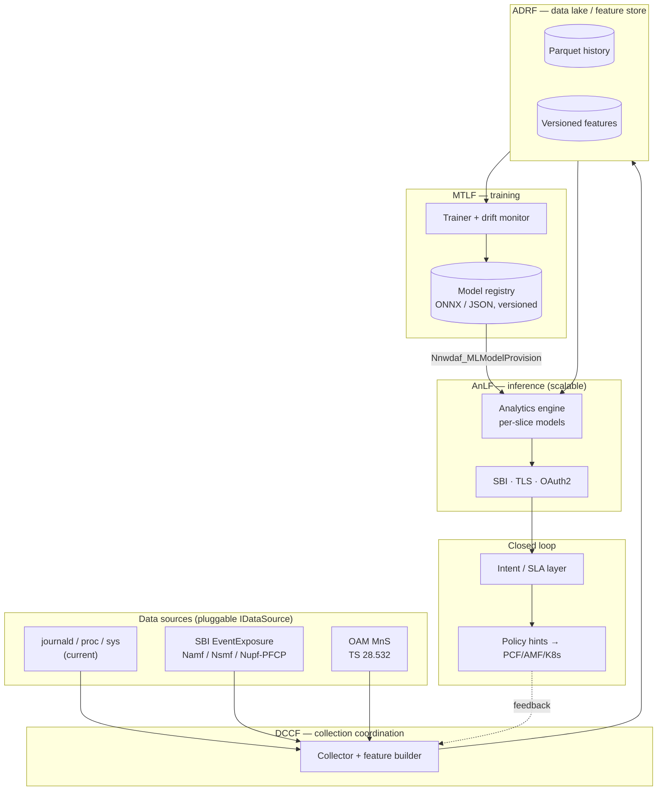

# Open5GS NWDAF — 5G & 6G Enhancement Plan

**Document type:** Technical enhancement roadmap
**Audience:** Core network engineers, data/ML engineers, product owners
**Baseline reviewed:** `v1.0.0` (Rel-17, C++17, 7 analytics IDs, Isolation Forest + EWMA)
**Perspectives applied:** Telecommunications (5G Core / SBA) engineer · Data analyst / ML engineer
**Date:** 2026-08-04

---

## 1. Executive summary

Today the project is a **solid, correct, deliberately-scoped Rel-17 NWDAF**: it registers with the NRF, collects real Open5GS signals (journald, `/proc`, `/sys`, MongoDB), serves seven `Nnwdaf` analytics over a hardened SBI, and ships native in-process ML (Isolation Forest + EWMA) with no Python dependency. That is a strong foundation and a rare thing in the open-source 5G ecosystem.

The gap between *"a working NWDAF"* and *"the reference analytics function for 5G-Advanced and the on-ramp to 6G"* falls into three buckets:

1. **Telecom completeness** — the collection path is Open5GS-specific plumbing (log scraping) rather than standardized SBI event exposure; there is no slice (S-NSSAI) awareness, no MTLF/AnLF split, no DCCF/ADRF data-plane, and roughly half the Rel-17/18 analytics catalogue is unimplemented.
2. **Data & ML maturity** — two models, no seasonality, no drift detection, no model registry, no evaluation harness, no feature store, and per-UE analytics are blocked by the `gtp5g` throughput-measurement constraint.
3. **6G readiness** — none of the AI-native, intent-driven, energy-aware, digital-twin, or sensing (ISAC) constructs that ITU IMT-2030 and 3GPP Rel-19/20 are converging on.

This plan is organized into **three horizons** and is explicitly dual-lens: every workstream is annotated **[TE]** (telecom engineering) and/or **[DA]** (data analytics). Each item maps to concrete files in this repository so it is actionable, not aspirational.

| Horizon | Theme | Timeframe | Headline outcome |
|---|---|---|---|
| **H1** | Rel-17/18 completeness & data-path realism | 0–6 months | Slice-aware, PFCP-fed, spec-complete analytics |
| **H2** | Data & ML platform maturity (MLOps) | 6–12 months | Model registry, drift, seasonality, evaluation, ADRF |
| **H3** | 5G-Advanced → 6G readiness | 12–24 months | AI-native NF, intent, energy KPIs, digital twin, ISAC |

---

## 2. Current-state assessment

### 2.1 Strengths (keep and build on)

- **Spec-anchored surface** — analytics IDs, SBI paths, subscription model and NRF flow follow TS 23.288 / 29.520 / 29.510. (`src/nwdaf_server.cpp`, `src/nwdaf_analytics.cpp`)
- **Native, dependency-light ML** — a genuine Isolation Forest (`src/ml/isolation_forest.cpp`, iterative tree build, path-length scoring) plus EWMA, with a 5-dimensional feature vector (`AnomalyFeatures` in `include/nwdaf_analytics.hpp`), quality-gated retraining, and atomic model persistence.
- **Operational hygiene** — TLS/mTLS, OAuth2, token-bucket rate limiting, Prometheus `/metrics`, health/readiness probes, SQLite persistence, hardened build flags, 85 Catch2 tests with a mock core.
- **Sound engineering discipline** — `shared_mutex` around the model, write-then-rename persistence, injectable clock for testability, graceful degradation when optional deps are absent.

### 2.2 Gaps by lens

| # | Gap | Lens | Evidence in repo |
|---|---|---|---|
| G1 | Data collection is **log/procfs scraping**, not standardized event exposure (`Nnf_EventExposure`, OAM MnS) | TE | `NwdafCollector::collectAmfEvents` parses journald with `supi_regex` |
| G2 | **No slice (S-NSSAI) dimension** anywhere in analytics or features | TE | `VALID_ANALYTICS_IDS` has no `SLICE_LOAD_LEVEL`; features are network-wide |
| G3 | **Per-UE / per-session throughput impossible** — `gtp5g` forces network-wide `/sys/class/net` reads | TE/DA | Notes in `qosSustainability`, `abnormalBehaviour` |
| G4 | **No MTLF/AnLF split** — no model provisioning / sharing between NWDAFs | TE | Single monolithic engine, model file on local disk |
| G5 | **Half the Rel-17/18 analytics catalogue missing** (`DN_PERFORMANCE`, `DISPERSION`, `WLAN`, `SM_CONGESTION`, redundant-transmission, `PFD`) | TE | 7 of ~15 IDs implemented |
| G6 | **ML is shallow** — no seasonality, no trend+seasonal decomposition, EWMA only; MOS is a static step function | DA | `serviceExperience` uses `if dl>1000 → 4.5` ladder |
| G7 | **No model lifecycle** — no registry, versioning, drift/concept-drift detection, or retraining triggers beyond a manual `POST /train` | DA | `retrain()` is manual and single-model |
| G8 | **No evaluation harness / labeled data** — anomaly precision/recall unknown | DA | Tests assert plumbing, not model quality |
| G9 | **No feature store / data lake** — history is a bounded SQLite ring; Parquet export is only on the roadmap | DA | `history_backend: sqlite`, 360-sample ring |
| G10 | **Confidence is heuristic** — coverage×0.95, not calibrated probability | DA | `computeConfidence()` |
| G11 | **No horizontal scale / HA** — single process, single SQLite file, no Helm/K8s | TE | Dockerfile is single-binary; roadmap notes Helm |
| G12 | **No 6G constructs** — energy/sustainability KPIs, intent, digital twin, AI-as-NF, ISAC | TE/DA | Absent by design (Rel-17 scope) |

---

## 3. Horizon 1 — Rel-17/18 completeness & data-path realism (0–6 months)

> Goal: make the analytics *trustworthy and slice-aware* by fixing the data path and closing the highest-value spec gaps.

### H1.1 — Standardize the data ingestion path **[TE]**
The single biggest realism gap is that collection is log scraping. Introduce a pluggable `IDataSource` interface behind `NwdafCollector` with two backends:

- **Backend A (keep):** the current journald/procfs collector — the zero-friction Open5GS default.
- **Backend B (new):** an **event-exposure consumer** that subscribes to `Namf_EventExposure`, `Nsmf_EventExposure`, and `Nupf`/`N4 PFCP` usage reports, plus **OAM Management Services (MnS)** performance measurements (TS 28.532/28.550). This is what a production NWDAF actually consumes and it unlocks per-session data (see H1.3).

*Deliverable:* `include/nwdaf_datasource.hpp` abstraction; config switch `collection_mode: [scrape|sbi]`; feature parity tests via the existing mock core.

### H1.2 — Slice awareness end-to-end (`SLICE_LOAD_LEVEL`, §6.3) **[TE][DA]**
Thread **S-NSSAI** (SST/SD) through the data model, features, and API:

- Extend `ThroughputSample`, `AmfEvent`, `SmfEvent`, `NfMetric` with an optional `snssai` field.
- Add `SLICE_LOAD_LEVEL` to `VALID_ANALYTICS_IDS` and a `sliceLoadLevel()` method returning per-slice load, `loadLevelInformation`, and `NumberOfUes`.
- Extend the anomaly feature vector from 5-D to a **per-slice** model set (one Isolation Forest per active S-NSSAI, or a slice-ID one-hot dimension).

*Why it matters:* slicing is the defining SA feature; slice-level SLA assurance is the top operator NWDAF use case.

### H1.3 — Unblock per-UE / per-session analytics via PFCP usage reporting **[TE][DA]**
`gtp5g` blocks user-space capture, but the **UPF already produces per-PDR/URR volume counters over N4 (PFCP Usage Reports)**. Consume those instead of `/sys/class/net`:

- New `PfcpUsageSource` that reads Open5GS UPF usage reports (or the SMF's N4 session view) keyed by SUPI + PDU session + QFI.
- Replaces the honest-but-limiting "per-UE throughput not available" notes in `qosSustainability` and `abnormalBehaviour` with real per-UE series.

This single change upgrades three analytics (`UE_COMMUNICATION`, `QoS_SUSTAINABILITY`, `SERVICE_EXPERIENCE`) from network-wide estimates to per-subscriber truth.

### H1.4 — Complete the Rel-17/18 analytics catalogue **[TE]**
Prioritized by operator value:

| Analytics ID | Spec | Effort | Notes |
|---|---|---|---|
| `SLICE_LOAD_LEVEL` | §6.3 | M | See H1.2 |
| `DN_PERFORMANCE` | §6.14 | M | Needs AF/edge input (`Naf_EventExposure`) |
| `DISPERSION` | §6.10 | M | Data volume/session dispersion — pure analytics on existing series |
| `SM_CONGESTION` (User Data Congestion) | §6.8 | S | Reuses throughput + NF-load features |
| `REDUNDANT_TRANSMISSION` | §6.12 | S | URLLC use case |
| `WLAN_PERFORMANCE` | §6.11 | L | Optional / N3IWF-dependent |

### H1.5 — MOS/service-experience model upgrade **[DA]**
Replace the static DL-throughput ladder in `serviceExperience()` with an **ITU-T E-model-style estimator** (or a small regression trained on synthetic QoE data) that combines throughput, packet-loss/retransmission signals (from PFCP), latency proxy, and active-session ratio. Keep the step function as a fallback when inputs are missing.

### H1.6 — OpenAPI 3.0 + conformance **[TE]**
Publish the SBI from the TS 29.520 YAML (already on the roadmap) and add a **contract test** in CI that validates responses against the schema. This is the cheapest credibility win for external NF consumers.

**H1 exit criteria:** slice-aware analytics live; per-UE series from PFCP; ≥11 analytics IDs; OpenAPI-validated SBI; SBI-mode ingestion optional.

---

## 4. Horizon 2 — Data & ML platform maturity / MLOps (6–12 months)

> Goal: turn "two models on local disk" into a governed, observable, self-maintaining analytics pipeline — the data-analyst backbone.

### H2.1 — MTLF / AnLF split (Rel-17 §5.1) **[TE][DA]**
Separate the **Model Training Logical Function** from the **Analytics Logical Function**. This is both a spec item and the architectural prerequisite for everything else in H2:

- `nwdaf-mtlf` service owns training, versioning, and `Nnwdaf_MLModelProvision` (model publish/subscribe between NWDAF instances).
- `nwdaf-anlf` (the current engine) consumes a model reference and does inference only.
- Enables **NWDAF hierarchy**: central MTLF trains, edge AnLFs infer.

### H2.2 — Model registry & lifecycle **[DA]**
- Version every model (`isolation_forest.json` → `models/<analyticsId>/<snssai>/<version>.json` + a manifest with training window, feature schema, metrics, seed).
- Add `GET /nwdaf-analytics/v1/models` and rollback support.
- Keep the atomic write-then-rename discipline already in `saveModels()`.

### H2.3 — Drift & concept-drift detection **[DA]**
Add a monitor that runs on the collection cadence:

- **Data drift:** population-stability index (PSI) / KL-divergence between the training feature distribution and the live window.
- **Concept drift:** track anomaly-rate stability; page/log when the live anomaly fraction diverges from `anomaly_contamination` beyond a band.
- **Auto-retrain trigger:** replace the purely manual `POST /train` with a drift-or-schedule trigger (keep manual as override). Emit a Prometheus `nwdaf_model_drift_psi` gauge.

### H2.4 — Seasonality-aware forecasting **[DA]**
EWMA has no notion of daily/weekly traffic cycles. Add a **Holt-Winters (triple-exponential) forecaster** — still pure C++, still dependency-light — for `NF_LOAD` and `QoS_SUSTAINABILITY`. Optionally add an **ONNX Runtime** inference path (build-flag-gated, degrades gracefully like the other optional deps) so externally-trained GRU/LSTM/Transformer models can be dropped in without a Python runtime at serve time.

### H2.5 — ADRF + data lake / feature store **[DA]**
- Implement **Parquet export** (roadmap item) → an **Analytics Data Repository Function (ADRF, Rel-17)** so historical data survives beyond the 360-sample ring and can feed offline training.
- Introduce a lightweight **feature store** (materialized, versioned feature tables) so training and serving use identical feature definitions — closing the train/serve skew risk that H2.1 otherwise introduces.
- Add **DCCF (Data Collection Coordination Function)** coordination so multiple consumers don't each hammer the source NFs.

### H2.6 — Evaluation harness & synthetic ground truth **[DA]**
Today model *quality* is untested. Add:

- A **labeled synthetic dataset generator** (extend the traffic simulator already in `nwdaf_server.cpp`) that injects known anomalies (DDoS bursts, silent-UE, signalling storms).
- Offline **precision/recall/F1 + PR-AUC** reporting for the anomaly model, and **MAPE/sMAPE** for forecasters, wired into CI as a regression gate.
- **Calibrated confidence:** replace the coverage×0.95 heuristic in `computeConfidence()` with an isotonic/Platt calibration against the eval set.

### H2.7 — Explainability **[DA]**
The Isolation Forest already yields per-sample anomaly scores; expose **per-feature attribution** (which of DL/UL/NF-load/sessions/auth-rate drove the flag) in `ABNORMAL_BEHAVIOUR` responses and on the dashboard. Operators trust what they can explain.

**H2 exit criteria:** MTLF/AnLF split; model registry with rollback; automated drift-triggered retraining; seasonal forecaster; ADRF/Parquet lake; CI quality gates on precision/recall/MAPE.

---

## 5. Horizon 3 — 5G-Advanced → 6G readiness (12–24 months)

> Goal: position the NWDAF as the **AI-native analytics/automation function** that IMT-2030 (6G) and 3GPP Rel-19/20 are converging toward.

### H3.1 — Closed-loop automation & intent **[TE][DA]**
Move from *insight* to *action*. Emit standardized actions from analytics — e.g. `NF_LOAD` "SCALE_OUT" (already computed) becomes an actual **PCF/AMF policy hint** or a K8s scaling signal. Add an **intent layer** (TM Forum / 3GPP intent-driven management) that accepts high-level SLAs ("slice X: MOS ≥ 4.2") and closes the loop via analytics-driven policy.

### H3.2 — Energy efficiency & sustainability analytics **[TE][DA]**
A headline 6G KPI. Add an `ENERGY_EFFICIENCY` analytics that correlates NF CPU/throughput (already collected) with power proxies, reports **bits-per-Joule** and **carbon-intensity-aware** recommendations (e.g. idle-NF power-down windows). This reuses existing `NfMetric` load data.

### H3.3 — AI-native / AI-as-a-Network-Function **[DA]**
6G treats AI/ML as a first-class NF (AI/ML plane). Evolve MTLF into a general **model-serving and federated-learning coordinator**:
- **Federated learning** across distributed NWDAFs (train locally, aggregate globally) — privacy-preserving, no raw-data centralization.
- **Model marketplace** via `Nnwdaf_MLModelProvision` for cross-vendor model exchange in **ONNX**.

### H3.4 — Network Digital Twin **[TE][DA]**
Feed the ADRF data lake (H2.5) into a **digital-twin** simulation surface: replay historical state, run "what-if" scaling/slicing scenarios, and validate closed-loop actions *before* applying them to the live core. The existing traffic simulator is the seed of this.

### H3.5 — Integrated Sensing & Communication (ISAC) & new data types **[TE]**
6G adds sensing/positioning and RIS/sub-networks. Extend the data model and analytics to ingest **sensing/positioning events** and expose **environment-awareness analytics**. Speculative but strategically important — architect the `IDataSource` abstraction (H1.1) so these are additive.

### H3.6 — Scale, HA & multi-PLMN **[TE]**
- **Kubernetes Helm chart + horizontal scaling** (roadmap) — stateless AnLF replicas behind the SBI, shared ADRF/registry state.
- **HA persistence** — move from single SQLite file to a replicated store for the subscription/model state.
- **Roaming / multi-PLMN** analytics and inter-NWDAF federation across operators.

**H3 exit criteria:** at least one closed-loop use case in production; energy-efficiency analytics; federated-learning PoC across ≥2 NWDAF instances; Helm-deployed horizontally-scaled AnLF; digital-twin what-if surface.

---

## 6. Prioritized backlog (impact × effort)

| Rank | Item | Horizon | Lens | Impact | Effort |
|---|---|---|---|---|---|
| 1 | PFCP usage reporting → per-UE data (H1.3) | H1 | TE/DA | ★★★★★ | M |
| 2 | Slice awareness / `SLICE_LOAD_LEVEL` (H1.2) | H1 | TE/DA | ★★★★★ | M |
| 3 | Drift detection + auto-retrain (H2.3) | H2 | DA | ★★★★☆ | M |
| 4 | Evaluation harness + calibrated confidence (H2.6) | H2 | DA | ★★★★☆ | M |
| 5 | Pluggable SBI/OAM ingestion (H1.1) | H1 | TE | ★★★★☆ | L |
| 6 | MTLF/AnLF split (H2.1) | H2 | TE/DA | ★★★★☆ | L |
| 7 | Seasonal (Holt-Winters) forecaster (H2.4) | H2 | DA | ★★★☆☆ | S |
| 8 | Complete Rel-17/18 catalogue (H1.4) | H1 | TE | ★★★☆☆ | M |
| 9 | ADRF / Parquet data lake (H2.5) | H2 | DA | ★★★☆☆ | M |
| 10 | Energy-efficiency analytics (H3.2) | H3 | TE/DA | ★★★☆☆ | S |
| 11 | Helm chart + horizontal scale (H3.6) | H3 | TE | ★★★☆☆ | M |
| 12 | Federated learning PoC (H3.3) | H3 | DA | ★★★★☆ | L |

*Effort: S ≈ days, M ≈ 1–3 weeks, L ≈ 1–2 months.*

*Quick wins to sequence first:* #7 (seasonal forecaster) and #10 (energy analytics) are small, self-contained, and demo well; #1 and #2 are the highest-leverage foundations and should start immediately in parallel.

---

## 7. Target architecture (H2/H3)

---

## 8. Cross-cutting: metrics of success

| KPI | Baseline (v1.0.0) | H1 target | H2 target |
|---|---|---|---|
| Analytics IDs implemented | 7 | ≥11 | ≥13 |
| Per-UE analytics | ✗ | ✓ (PFCP) | ✓ |
| Slice-aware | ✗ | ✓ | ✓ |
| Anomaly precision/recall | unmeasured | measured | ≥0.9 / ≥0.85 on synthetic set |
| Forecast error (sMAPE, NF_LOAD) | unmeasured | measured | ≤15% |
| Automated retraining | manual only | scheduled | drift-triggered |
| Confidence calibration | heuristic | — | calibrated (isotonic) |
| SBI conformance | manual | OpenAPI-validated in CI | ✓ |

---

## 9. Risks & guardrails

- **Keep the dependency-light ethos.** Every new capability (ONNX, PFCP, Parquet) must follow the existing *graceful-degradation* pattern — build-flag-gated, absent-dependency safe — as MongoDB/SQLite/TLS already are.
- **Don't break the zero-friction Open5GS default.** The scrape backend stays the out-of-box path; SBI/OAM ingestion is opt-in.
- **Train/serve skew** is the main risk introduced by the MTLF/AnLF split — the feature store (H2.5) is the mitigation and should not be deferred past H2.1.
- **Spec churn:** Rel-19/20 and IMT-2030 are still stabilizing; treat H3 items as *architecturally prepared* (via the `IDataSource` and MTLF abstractions) rather than prematurely implemented.
- **Test the models, not just the plumbing.** The current 85 tests validate wiring; H2.6's quality gates are what keep analytics *correct* as models evolve.

---

## 10. Suggested first sprint (2 weeks)

1. Land the `IDataSource` abstraction (H1.1) as a no-op refactor around today's collector — unblocks everything.
2. Thread `snssai` through the data structs (H1.2) behind a feature flag.
3. Ship the **Holt-Winters** forecaster (H2.4) and wire it into `NF_LOAD` alongside EWMA for A/B comparison.
4. Extend the traffic simulator to inject **labeled anomalies** and stand up the evaluation harness skeleton (H2.6) in CI.

These four are low-risk, high-leverage, and each independently demonstrable on the existing dashboard.

---

*This plan is intentionally mapped to the current codebase so it can be executed incrementally without a rewrite. Every horizon builds on the last; nothing here requires discarding the strong Rel-17 foundation already in place.*
